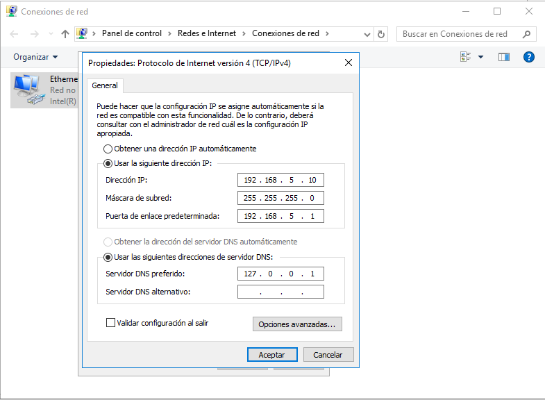
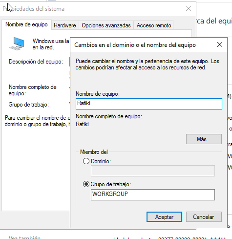
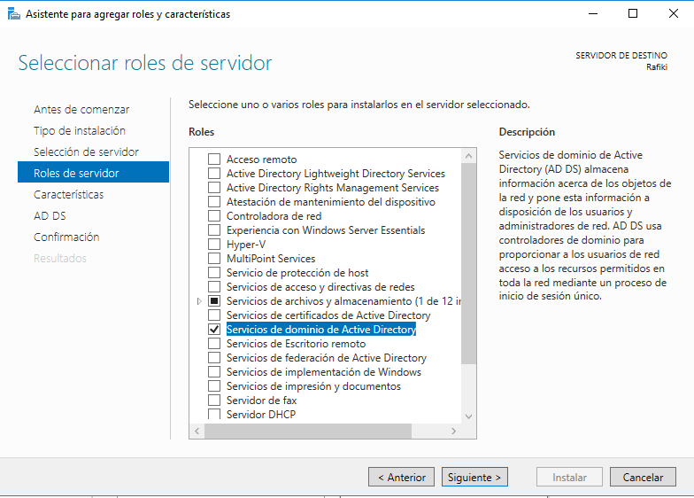
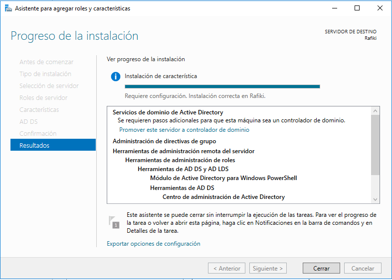
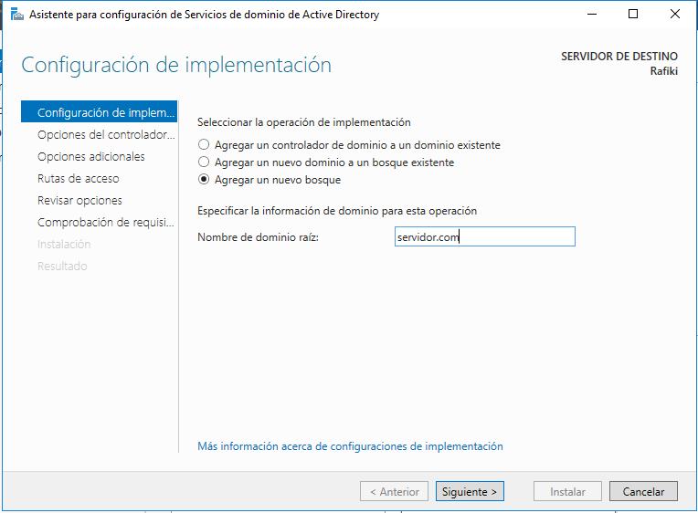
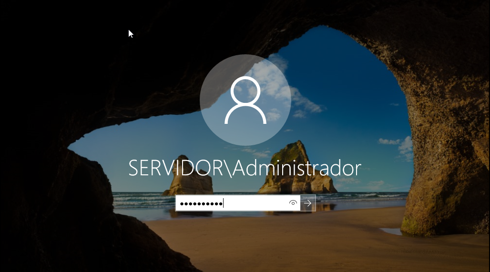

# WindowsServer
## Organización de la empresa
La empresa está organizada en tres departamentos los cuales son: Dirección, Almacén y Marketing. Cada departamento tiene un equipo y dos empleados que solo podrán entrar al equipo que está en su departamento.

En la empresa solo hay una impresora para todos.

Los usuarios solo podrán entrar al sistema de 15:00 a 22:00 de lunes a viernes.

Todo el sistema está en la red 192.168.5.0/24.

## Cambio de la IP y del Nombre al Servidor
Antes de hacer nada en el servidor tenemos que hacer unas configuraciones básicas. Lo primero que haremos es cambiar el nombre del equipo a uno distintivo. También hay que cambiar la IP del servidor a una estática para que el servidor siempre esté accesible y no haya problemas de acceso desde los clientes.

## Instalación de Active Directory
Para que nuestro equipo empiece a funcionar como servidor necesitamos un servicio. Los servicioes se agregan desde el enlace Administrar > Agregar Roles. Desde ahí siguiendo los pasos instalaremos el rol de Active Directory.

Una vez lo tenemos seleccionado solo tenemos que darle a siguiente hasta que nos de la opción de instalar.

Una vez se haya instalado nos aparecerá un mensaje en el que nos dirá que el rol ya ha sido instalado, pero eso no es todo, Ahora tendremos que configurarlo promoviendolo como controlador de dominio.

Lo primero que tenemos que configurar es la implementación que en nuestro caso escogeremos un nuebo bosque y además le daremos un nuevo nombre de dominio a nuestro servidor. Aquí nos pedirá el nombre del nuevo dominio, y la contraseña del Administrador del mismo. Una vex promovido, se reiniciará el sistema, ya conectado dentro del nuevo dominio.

