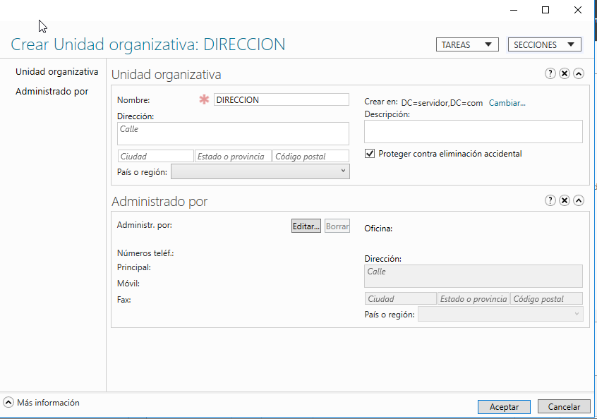

# WindowsServer
## Organización de la empresa
La empresa está organizada en tres departamentos los cuales son: Dirección, Almacén y Marketing. Cada departamento tiene un equipo y dos empleados que solo podrán entrar al equipo que está en su departamento.

En la empresa solo hay una impresora para todos.

Los usuarios solo podrán entrar al sistema de 15:00 a 22:00 de lunes a viernes.

Todo el sistema está en la red 192.168.5.0/24.

## Cambio de la IP y del Nombre al Servidor
Antes de hacer nada en el servidor tenemos que hacer unas configuraciones básicas. Lo primero que haremos es cambiar el nombre del equipo a uno distintivo. También hay que cambiar la IP del servidor a una estática para que el servidor siempre esté accesible y no haya problemas de acceso desde los clientes.

## Instalación de Active Directory
Para que nuestro equipo empiece a funcionar como servidor necesitamos un servicio. Los servicioes se agregan desde el enlace Administrar > Agregar Roles. Desde ahí siguiendo los pasos instalaremos el rol de Active Directory.

Una vez lo tenemos seleccionado solo tenemos que darle a siguiente hasta que nos de la opción de instalar.

Una vez se haya instalado nos aparecerá un mensaje en el que nos dirá que el rol ya ha sido instalado, pero eso no es todo, Ahora tendremos que configurarlo promoviendolo como controlador de dominio.

Lo primero que tenemos que configurar es la implementación que en nuestro caso escogeremos un nuebo bosque y además le daremos un nuevo nombre de dominio a nuestro servidor. Aquí nos pedirá el nombre del nuevo dominio, y la contraseña del Administrador del mismo. Una vex promovido, se reiniciará el sistema, ya conectado dentro del nuevo dominio.

## Creación de las Unidades Organizativas de la Empresa
Nuestra empresa tiene tres departamentos en los que hay un equipo y dos empleados en cada uno. Lo primero que tenemos que hacer es crear la unidad organizativa para cada departamento, para ello hacemos clic en herramientas y nos vamos a la gestión de Active Directory. Desde ahí hacemos clic derecho sobre servidor(local) y seleccionamos crear una nueva unidad organizativa a la que le daremos el nombre deseado.

Una vez la tenemos creada accedemos a ella con un doble clic y dentro de ella creamos los correspondientes Equipos y Usuarios realizando los mismos pasos: Botón derecho > Nuevo > Equipo|Usuario.

Una vez creado todo, nos debería quedar algo así:

Ahora lo que tenemos que hacer es configurar los usuario. Para ello pondremos que los usuarios solo puedan entrar al equipo del departamento al que pertenecen.

Ahora vamos a limitar las horas en las que los usuario pueden iniciar sesión en el sistema.

## Impresora
Por último tenemos que agregar la impresora y para ello tenemos que agregar el rol al servidor.

Una vez instalado tenemos que configurarla y añadir la impresora.

## DHCP
Lo siguiente que vamos a hacer es agregar un nuevo rol a nuestro servidor de DHCP. Esto lo hacemos de la misma forma en la que hemos añadido el Active Directory.

Después de añadirlo necesitamos configurarlo para que de el rango de IPs que nosotros queramos, y agregar a la resolución DNS la IP del Servidor. Para ello lo que tenemos que hacer es agregar un nuevo ámbito.

